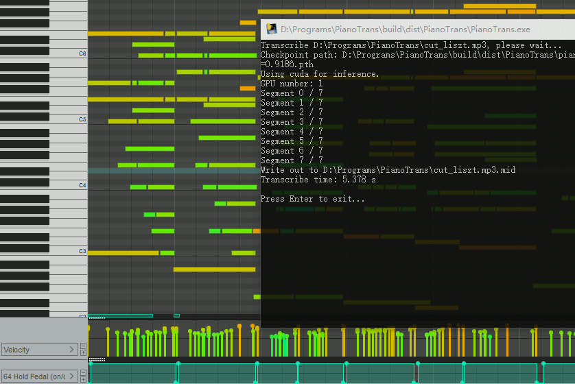

## Simple GUI for ByteDance's Piano Transcription with Pedals

[ByteDance's Piano Transcription][1] is the PyTorch implementation of the
piano transcription system, "High-resolution Piano Transcription with Pedals
by Regressing Onsets and Offsets Times `[1]`".

Using this, we can transcribe piano recordings into MIDI files with pedals.

This is a simple GUI and packaging for Windows.

### Requirement

* OS: Windows 7 or later (64-bit)
* Memory: at least 4G

Only Windows 10 is tested.

It works on Linux, mac OS, Windows, but only Windows package is provided
here.

If you use other OS, follow those [install and usage][2] guides instead.

### How to use

1. Download [Microsoft Visual C++ Redistributable for Visual Studio 2015, 2017 and 2019][3] `vc_redist_x64.exe` and install
2. Download and unpack [PianoTrans.zip][4]
3. Close other apps to free memory, need at least 2G free memory
4. Run `PianoTrans.exe` in `PianoTrans` directory
5. Choose audio files, multiple selection is supported
6. Result MIDI files are in the same directory as the audio files

If you want right click menu for audio files, run `RightClickMenuRegister.bat`,
then you can right click an audio file, and choose `Piano Transcribe`.

[1]: https://github.com/bytedance/piano_transcription
[2]: https://github.com/qiuqiangkong/piano_transcription_inference
[3]: https://support.microsoft.com/en-us/help/2977003/the-latest-supported-visual-c-downloads
[4]: https://github.com/azuwis/PianoTrans/releases/download/v0.1/PianoTrans-v0.1.zip

### Changelog

#### [0.1] - 2021-02-02

* Initial release.

## Cite
`[1]` Qiuqiang Kong, Bochen Li, Xuchen Song, Yuan Wan, and Yuxuan Wang. "High-resolution Piano Transcription with Pedals by Regressing Onsets and Offsets Times." arXiv preprint arXiv:2010.01815 (2020). [[pdf]](https://arxiv.org/pdf/2010.01815.pdf)
